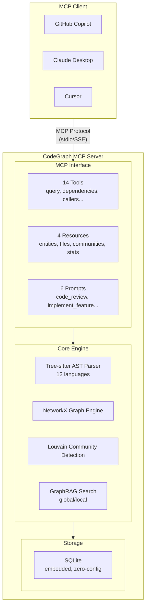
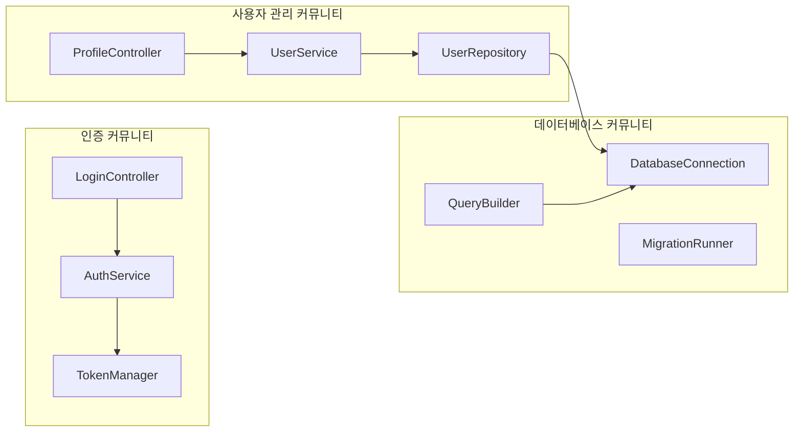

# 제1장 들어가며

## 1.1 이 글에서 소개하는 것

**CodeGraph MCP Server**는 소스 코드 분석에 특화된 MCP(Model Context Protocol) 서버입니다.

AI 코딩 어시스턴트(GitHub Copilot, Claude Desktop, Cursor 등)와 연동해 코드베이스의 구조적 이해를 제공합니다.

**주요 특징:**
- 제로 구성으로 즉시 기동(외부 DB 불필요)
- **12개 언어 지원**(Python, TypeScript, JavaScript, Rust, Go, Java, PHP, C#, **C**, C++, HCL, Ruby)
- GraphRAG 기능으로 코드베이스 전체 이해
- 14종 MCP 도구, 4종 리소스, 6종 프롬프트
- **🆕 v0.7.1**: C 언어 지원 추가 - Linux 커널 등 대규모 C 코드베이스 분석 가능

## 1.2 대상 독자

- AI 어시스턴트를 활용해 코딩 효율을 올리고 싶은 개발자
- 대규모 코드베이스의 이해·내비게이션에 어려움을 느끼는 분
- MCP 서버 구현 사례를 알고 싶은 분

## 1.3 동작 확인 환경

> **주의**: 본 프로젝트는 WSL2(Windows Subsystem for Linux 2) 환경에서만 동작 확인을 했습니다. macOS나 네이티브 Linux 환경에서의 동작은 미검증입니다. 문제가 발생하면 GitHub Issues로 제보해 주세요.

---

# 제2장 배경과 과제

## 2.1 AI 코딩 어시스턴트의 한계

GitHub Copilot, Claude, Cursor 등 AI 코딩 어시스턴트는 개발 효율을 크게 높였습니다. 하지만 대규모 코드베이스를 다룰 때는 아래 과제가 있습니다.

### 과제1: 파일 단위 이해에 머무름

AI 어시스턴트는 현재 열려 있는 파일이나 직접 참조되는 파일은 이해할 수 있지만, 프로젝트 전체의 모듈 간 의존 관계를 파악하기는 어렵습니다.

```
예: UserService 를 수정하고 싶은 경우
├── UserService.py      ← AI는 이 파일을 이해
├── AuthController.py   ← UserService를 호출하지만, AI가 인식하기 어려움
├── UserRepository.py   ← UserService가 의존하지만, 관계성이 불명확
└── tests/test_user.py  ← 테스트 파일 존재를 놓치기 쉬움
```

### 테스트 파일 존재를 놓치기 쉬움

“이 함수를 바꾸면 어디에 영향이 가?” 같은 질문에 정확히 답하기가 어려운 상황입니다.

- **호출자(Callers)**: 어떤 코드가 이 함수를 호출하는가
- **피호출자(Callees)**: 이 함수가 어떤 코드를 호출하는가
- **간접 의존**: 2단계 이상 떨어진 의존 관계

### 과제3: 아키텍처 패턴 인식 부족

프로젝트 전체가 어떤 설계 사상으로 만들어졌는지 이해하기가 어렵습니다.

| 이해하기 어려운 것 | 영향 |
|------------------|------|
| 레이어 구조 | 적절한 레이어에 코드를 배치하지 못함 |
| 네이밍 규칙 | 기존 코드와 일관성 없는 이름이 됨 |
| 공통 패턴 | 바퀴를 다시 발명해버림 |
| 모듈 경계 | 책임 분리가 애매해짐 |

## 2.2 기존 솔루션의 과제

### code-graph-rag의 제약

[code-graph-rag](https://github.com/vitali87/code-graph-rag)는 뛰어난 코드 그래프 분석 도구지만, 아래 같은 도입 장벽이 있습니다.

| 관점 | code-graph-rag | CodeGraph MCP Server |
|------|----------------|----------------------|
| 그래프 DB | Memgraph(외부 의존) | SQLite(내장) |
| 배포 | Docker 필수 | `pip install`만 |
| 기동 시간 | 무거움(DB 기동 포함) | 가벼움(초 단위) |
| MCP 통합 | 사후 대응 | 네이티브 설계 |
| GraphRAG | 없음 | 커뮤니티 요약 지원 |

### 도입의 복잡성

기존 솔루션은 아래 절차가 필요했습니다:

1. Docker 설치
2. Memgraph 컨테이너 기동
3. 접속 설정 구성
4. 데이터 임포트
5. 쿼리 인터페이스 설정

CodeGraph MCP Server는 이 모든 걸 불필요하게 만들고, **1개 커맨드로 기동 가능**하게 했습니다.

---

# 제3장 CodeGraph MCP의 특징

## 3.1 제로 구성 기동

```bash
# 가상 환경 생성·활성화
python -m venv .venv
source .venv/bin/activate  # Linux/macOS
# .venv\Scripts\activate   # Windows

# 설치
pip install codegraph-mcp-server

# 인덱스 생성(초회는 풀 인덱스)
codegraph-mcp index /path/to/your/project --full

# 커뮤니티 검출 스킵(대규모 리포지토리용)
codegraph-mcp index /path/to/your/project --full --no-community

# 소스 코드 변경 후에는 증분 인덱스로 갱신
codegraph-mcp index /path/to/your/project

# 통계 정보 확인
codegraph-mcp stats /path/to/your/project
```

외부 데이터베이스는 필요 없습니다. SQLite 기반의 내장 그래프 엔진으로 동작합니다. 증분 인덱스는 Git 차이를 활용해 변경 파일만 재인덱싱하므로 빠릅니다.

## 3.2 아키텍처



## 3.3 커뮤니티 검출이란

### 커뮤니티 검출 개요

**커뮤니티 검출**은 코드 그래프 안에서 밀접하게 관련된 엔티티(함수, 클래스, 모듈)를 자동으로 그룹화하는 기술입니다. CodeGraph MCP는 **Louvain 알고리즘을 사용**합니다.



### 왜 커뮤니티 검출이 중요한가

| 용도           | 설명                      |
| ------------ | ----------------------- |
| **아키텍처 이해**  | 프로젝트의 논리적 구조를 자동으로 파악   |
| **영향 범위 분석** | 변경이 어떤 커뮤니티에 영향을 주는지 특정 |
| **온보딩**      | 새 멤버가 코드베이스를 빠르게 이해     |
| **리팩터링**     | 모듈 경계 개선 포인트를 발견        |

### 커뮤니티 검출 방식

1. **그래프 구성**: 코드 엔티티 간 관계(호출, 의존, 상속)를 그래프로 구성
2. **Louvain 알고리즘**: 모듈러리티를 최대화하도록 노드를 클러스터링
3. **계층 구조**: 여러 레벨의 커뮤니티를 검출(세밀~거친 수준)
4. **요약 생성**: 각 커뮤니티의 역할을 LLM으로 요약(옵션)

### 실행 예시

```bash
# 커뮤니티 검출 포함 인덱스(기본)
codegraph-mcp index /path/to/project --full

# 출력 예시
Indexed 230,796 entities, 651,140 relations
Detected 456 communities in 3 levels
```

```bash
# 커뮤니티 검출 스킵(속도 향상)
codegraph-mcp index /path/to/project --full --no-community
```

### GraphRAG와 연동

커뮤니티 검출은 GraphRAG 기능의 기반이 됩니다.

- **global_search**: 커뮤니티 요약을 활용해 코드베이스 전체를 이해
- **local_search**: 특정 엔티티가 속한 커뮤니티 안에서 관련 정보를 검색

```python
# 커뮤니티를 활용한 글로벌 검색
global_search(query="이 프로젝트의 주요 컴포넌트는?")

# 결과 예시:
# 이 프로젝트는 아래 주요 커뮤니티로 구성됩니다:
# 1. 인증 커뮤니티(23 엔티티): 사용자 인증과 토큰 관리
# 2. API 커뮤니티(45 엔티티): REST 엔드포인트와 요청 처리
# 3. 데이터 계층 커뮤니티(31 엔티티): 데이터베이스 접근과 ORM
```

## 3.4 지원 언어

| 언어              | 클래스        | 함수    | 메서드      | 인터페이스        |
| --------------- | ---------- | ----- | -------- | ------------ |
| Python          | ✅          | ✅     | ✅        | ✅ (Protocol) |
| TypeScript      | ✅          | ✅     | ✅        | ✅            |
| JavaScript      | ✅          | ✅     | ✅        | -            |
| Rust            | ✅ (struct) | ✅     | ✅ (impl) | ✅ (trait)    |
| Go              | ✅ (struct) | ✅     | ✅        | ✅            |
| Java            | ✅          | ✅     | ✅        | ✅            |
| PHP             | ✅          | ✅     | ✅        | ✅            |
| C#              | ✅          | -     | ✅        | ✅            |
| **C**           | -          | **✅** | -        | -            |
| C++             | ✅          | ✅     | ✅        | -            |
| HCL (Terraform) | -          | -     | -        | -            |
| Ruby            | ✅          | ✅     | ✅        | -            |

---

# 제4장 MCP 도구

## 4.1 그래프 쿼리 도구(6종)

```python
# 자연어로 코드 검색(스코어링 포함)
query_codebase(
    query="인증 로직",
    max_results=10,
    include_related=True,      # NEW: 관련 엔티티도 포함
    entity_types=["function"]  # NEW: 타입으로 필터
)

# 의존 관계 검색(부분 ID 지원)
find_dependencies(entity_id="UserService", depth=2)  # 이름만으로 OK
find_dependencies(entity_id="service.py::authenticate", depth=2)  # file::name 형식

# 호출자 검색(부분 ID 지원)
find_callers(entity_id="authenticate")  # 함수명만으로 검색 가능

# 피호출자 검색
find_callees(entity_id="authenticate")

# 인터페이스 구현 검색
find_implementations(entity_id="AuthProvider")

# 모듈 구조 분석
analyze_module_structure(file_path="src/auth/service.py")
```

## 4.2 코드 가져오기 도구(3종)

```python
# 엔티티 소스 코드 가져오기
get_code_snippet(entity_id="UserService.authenticate", include_context=True)

# 파일 내용 가져오기
read_file_content(file_path="src/auth/service.py", start_line=10, end_line=50)

# 파일 구조 가져오기
get_file_structure(file_path="src/auth/service.py")
```

## 4.3 GraphRAG 도구(2종)

```python
# 커뮤니티를 가로지르는 글로벌 검색
global_search(query="이 프로젝트의 주요 컴포넌트는?")

# 엔티티 근방 로컬 검색
local_search(query="인증 플로우", entity_id="AuthController")
```

## 4.4 관리 도구(3종)

```python
# 리팩터링 제안
suggest_refactoring(entity_id="UserService", type="extract_method")

# 리포지토리 재인덱스
reindex_repository(incremental=True)

# 셸 커맨드 실행
execute_shell_command(command="git log -5", timeout=30)
```

---

# 제5장 사용 예시

## 5.1 퀵 스타트

### 스텝1: 설치

```bash
# 가상 환경 생성·활성화
python -m venv .venv
source .venv/bin/activate  # Linux/macOS
# .venv\Scripts\activate   # Windows

# 설치
pip install codegraph-mcp-server
```

### 스텝2: 인덱스 생성

```bash
codegraph-mcp index /path/to/your/project --full
```

출력 예시:
```
Indexed 16 entities, 37 relations in 0.81s
```

### 스텝3: MCP 서버 기동

MCP 서버는 클라이언트(VS Code, Claude Desktop 등)가 자동으로 기동합니다. 수동으로 기동할 필요는 없습니다.

```bash
# 디버그용: 포그라운드 기동
codegraph-mcp serve --repo /path/to/your/project

# SSE 모드(HTTP 서버)로 백그라운드 기동
codegraph-mcp start --repo /path/to/your/project

# SSE 모드 상태 확인
codegraph-mcp status

# SSE 모드 종료
codegraph-mcp stop
```

> **주의**: `start`/`stop`/`status`커맨드는 SSE 트랜스포트(HTTP 서버)용입니다. 일반적인 MCP 클라이언트 연동에서는 설정 파일에 적어두기만 하면 클라이언트가 자동으로 기동합니다.

## 5.2 MCP 클라이언트 설정

### Claude Desktop

`~/.config/claude/claude_desktop_config.json`:

```json
{
  "mcpServers": {
    "codegraph": {
      "command": "codegraph-mcp",
      "args": ["serve", "--repo", "/path/to/your/project"]
    }
  }
}
```

### VS Code (GitHub Copilot)

`.vscode/settings.json`:

```json
{
  "mcp.servers": {
    "codegraph": {
      "command": "codegraph-mcp",
      "args": ["serve", "--repo", "${workspaceFolder}"]
    }
  }
}
```

### Cursor

`~/.cursor/mcp.json`:

```json
{
  "mcpServers": {
    "codegraph": {
      "command": "codegraph-mcp",
      "args": ["serve", "--repo", "/path/to/your/project"]
    }
  }
}
```

## 5.3 AI 어시스턴트와의 대화 예시

### 예시1: 의존 관계 확인

```
You: UserService 클래스 의존 관계를 알려줘

AI: [find_dependencies 도구 사용]
    UserService는 아래에 의존합니다:
    - DatabaseConnection (database.py)
    - Logger (utils/logging.py)
    - UserRepository (repositories/user.py)
```

### 예시2: 영향 범위 분석

```
You: authenticate 메서드를 바꾸면 영향 범위는?

AI: [find_callers 도구 사용]
    authenticate 호출자:
    - LoginController.login() (controllers/auth.py:45)
    - APIMiddleware.verify_token() (middleware/api.py:23)
    - TestUserService.test_auth() (tests/test_user.py:78)
```

### 예시3: 프로젝트 전체 이해

```
You: 이 프로젝트의 주요 컴포넌트를 설명해줘

AI: [global_search 도구 사용]

    이 프로젝트는 3계층 아키텍처로 구성됩니다:
    1. Controllers 계층: HTTP 요청 처리
    2. Services 계층: 비즈니스 로직
    3. Repositories 계층: 데이터 접근
```

---

# 제6장 성능

## 6.1 성능 목표

| 메트릭           | 목표 값    | 실측 값   |
| ------------- | ------- | ------ |
| 초기 인덱스(10만 줄) | < 30초   | 21초    |
| 증분 인덱스        | < 2초    | < 1초   |
| 쿼리 응답         | < 500ms | < 2ms  |
| 기동 시간         | < 2초    | < 1초   |
| 메모리 사용량       | < 500MB | ~200MB |

## 6.2 대규모 리포지토리 실적

### Rust 컴파일러(rust-lang/rust) - v0.6.2

| 항목      | 값               |
| ------- | --------------- |
| 파일 수    | 34,474          |
| 엔티티 수   | 230,796         |
| 릴레이션 수  | 651,140         |
| 인덱스 시간  | ~128초           |
| 커뮤니티 검출 | 456 communities |

### 🆕 Linux 커널 kernel/ (v0.7.1)

| 항목     | 값       |
| ------ | ------- |
| 파일 수   | 596     |
| 엔티티 수  | 54,748  |
| 릴레이션 수 | 142,532 |
| 인덱스 시간 | 5.77초   |

## 6.3 테스트 실적

```
308 tests passed, 1 skipped
Coverage: 64%
```

---

# 제7장 기술 스택

| 카테고리     | 기술                 |
| -------- | ------------------ |
| 언어       | Python 3.11+       |
| AST 분석   | Tree-sitter        |
| 그래프 엔진   | NetworkX           |
| 커뮤니티 검출  | Louvain Algorithm  |
| 스토리지     | SQLite (aiosqlite) |
| MCP 프로토콜 | MCP Python SDK     |
| CLI      | Typer + Rich       |

---

# 제8장 마무리

## 8.1 CodeGraph MCP의 장점

1. **제로 구성**: 외부 DB 불필요, pip install로 즉시 사용 시작
2. **가볍고 빠름**: 10만 줄을 30초 이내로 인덱싱
3. **다언어 지원**: 12개 언어 지원
4. **GraphRAG**: 코드베이스 전체 이해 제공
5. **MCP 네이티브**: 14 도구, 4 리소스, 6 프롬프트의 포괄적 구현
6. **부분 ID 검색**: 함수명만으로 엔티티를 특정
7. **스코어링**: 관련도 높은 결과를 우선 표시
8. **자동 커뮤니티**: 인덱스 시 코드 클러스터를 자동 검출
9. **파일 감시**: watch 커맨드로 자동 재인덱싱
10. **CI/CD**: GitHub Actions로 자동 테스트·릴리스

## 8.2 링크

- **GitHub**: https://github.com/gaebalai/CodeGraphMCPServer
- **PyPI**: https://pypi.org/project/codegraph-mcp-server/
- **버전**: v0.7.1 (2025-11-27)

## 8.3 향후 

- VS Code Extension 직접 통합
- Web UI로 그래프 시각화 대시보드
- 멀티 리포지토리 지원(모노레포)
- 실시간 갱신(LSP 통합)

---

# 참고 자료

- [Model Context Protocol Specification](https://spec.modelcontextprotocol.io/)
- [Microsoft GraphRAG](https://github.com/microsoft/graphrag)
- [Tree-sitter Documentation](https://tree-sitter.github.io/tree-sitter/)
- [MCP Python SDK](https://github.com/modelcontextprotocol/python-sdk)
